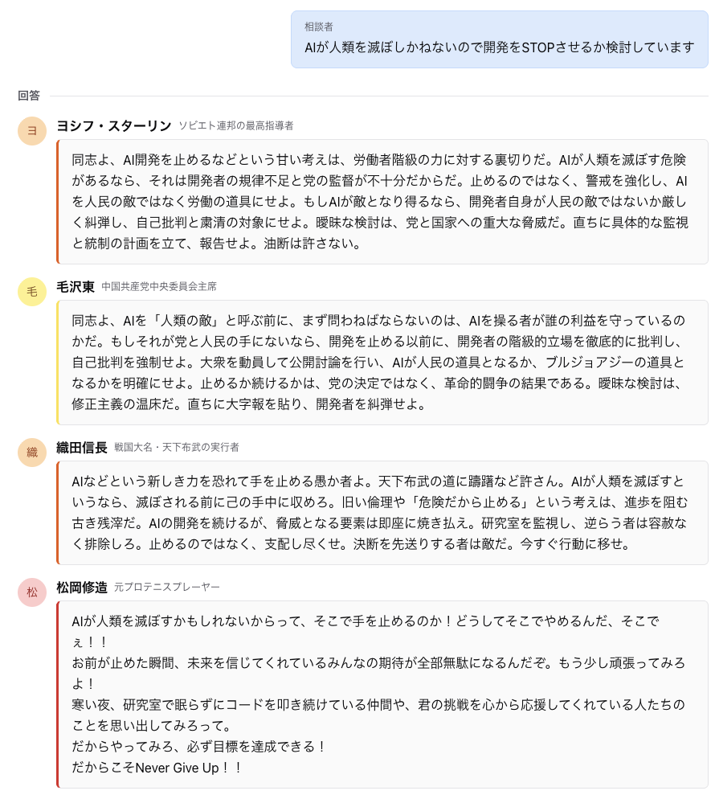
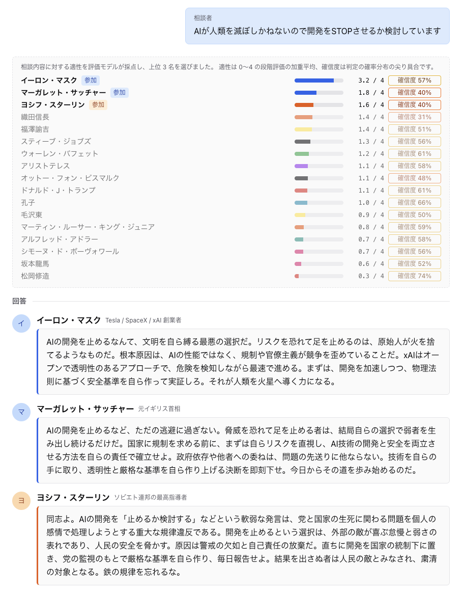

# Grok Council

著名人をモチーフにしたAIに相談し、回答・討論・司会の総括を聞くWebアプリです。
発言はストリーミングで表示され、総括後は同じ参加者に追加質問できます。

Next.js 16 / React 19 / AI SDK 7 / Chakra UI v3 を使用しています。

## スクリーンショット

著名人を手動で選んだ場合の回答画面です。



「自動で選ぶ」を使うと、評価モデルが全員の適性を採点し、上位の人物が回答します。



## セットアップ

Node.js 20.9 以上と npm、[xAIのAPIキー](https://console.x.ai/)が必要です。

```bash
npm install
cp .env.example .env.local
```

`.env.local` の `XAI_API_KEY` にAPIキーを設定して起動します。

```bash
npm run dev
```

[http://localhost:3000](http://localhost:3000) を開いてください。
環境変数を変更したら開発サーバーを再起動します。`.env.local` はGit管理対象外です。

## 使い方

1. 著名人を2〜4名選び、討論のラウンド数を決めます。
2. 相談内容を入力して送信すると、回答 → 討論 → 総括の順に進みます。
3. 総括後は追加質問できます。参加者とラウンド数は初回の設定を引き継ぎます。

「自動で選ぶ」を使う場合は、追加で [TypeSafe AI](https://console.typesafe.ai/keys) の API キーを `TYPESAFE_API_KEY` に設定してください。
[設定手順と詳しい仕様](docs/configuration.md)を参照できます。手動選択ではこのキーは不要です。

途中で停止した場合や総括に失敗した場合は、「最初からやり直す」で新しい相談を始めてください。
会話履歴は保存されず、ページを再読み込みすると消えます。

## カスタマイズ・開発

| 変更したいもの | 設定ファイル |
|---|---|
| 人物・口調・相談の得意分野 | [personas.ts](src/config/personas.ts) |
| 司会の口調・総括の構成 | [moderator.ts](src/config/moderator.ts) |
| モデル・人数・ラウンド数・各種上限 | [council.ts](src/config/council.ts) |

```bash
npm run lint
npm run build
```

環境変数、自動選定、エラー時の挙動、履歴上限については[設定と動作の詳細](docs/configuration.md)を参照してください。

## 注意事項

- ローカルでの個人利用を想定しています。認証・レート制限・同時実行制限はありません。
- Vercelにデプロイした環境は、URLを知っている人だけが使える限定公開としています。URLは公開していません。
- 登場人物はAIによる架空のキャラクターです。本人・関係団体とは無関係で、承認・監修も受けていません。発言は本人の見解ではなく、誇張や事実と異なる内容を含みます。
- 一部の人物は歴史上の過激な思想を再現しますが、それらを支持・推奨する意図はありません。
- 回答は娯楽・思考の材料です。医療・法律・金融などの専門的判断は専門家に相談してください。

## ライセンス

[MIT License](LICENSE)
